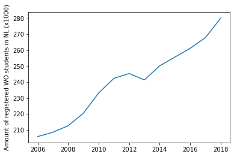

# CLS_Assignment
**Author:** Daniël Vink \
**Student number:** 10675140

## Paper titles: 
As requested, the titles of these crucially important papers.
1. **MCC van Dyke et al., 2019:** "Fantastic yeasts and where to find them: the hidden diversity of dimorphic fungal pathogens"
2. **JT Harvey, Applied Ergonomics, 2002:** "An analysis of the forces required to drag sheep over various surfaces"
3. **DW Zeigler et al., 2005:** "The neurocognitive effects of alcohol on adolescents and college students"

## Correlation?
When you plot the data in the CSV file against eachother, you can see that after crossing a threshold of 250k registered WO students, the yearly beer consumption in the Netherlands has risen dramatically.

You might be inclined to believe that these two facts are related, however, when both the increase of the beer consumption and registered WO students are plotted against time, you can see that these are not synchronous.

The national beer consumption has risen exponentially while the amount of registered students has seen a more linear increase. Even this comparison is unfair, however, as these values are not normalized. Relatively speaking, beer consumption has only increased around 5% while the amount of registered WO students has grown by around 30%. 
If you take that into consideration and plot the average yearly beer consumption per registered student (which is in itself bonkers as were talking about hectolitres) over time, you'll even see that consumption has decreased.
 

 So does this mean anything? Not really. It is in itself unfair to compare the national consumption of anything to a small part its population. Besides, a lot of variables are left out of the equation such as possible trends and ageing populations. 